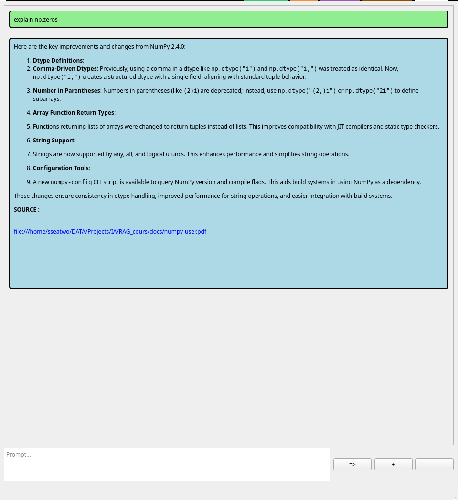

# RAG 

l'objectif c'est de faire une petite "application" pour avoir une IA en local capable de réexpliquer des thèmes (voir exemple)  tout en citant ses documents sources


# installation 

recomendé: python 3.12

```bash

python3.12 -m venv <nom de l env>

# linux 
source ./venv/bin/activate

#windows

.\venv\Scripts\activate

# installation des requierements

pip3 install -r requierement.txt

```

# utilisation 

lancer [[GUI.py]] puis posez ça question

+ pour ajouter des documents a la bdd (ne marche que sur des pdf pour l'instant)
- pour enlever les document de la bdd
=> pour poser sa question (si les sources ne contiennent pas de lien, il ne c'est pas basez sur les documents fournis)




# todo 

- [X] ajoute d'une interface pour posez des questions
- [X] GUI pour ajouter des documents dans la bdd local du RAG
- [X] GUI pour enlever des documents dans la bdd local du RAG
- [] ajouter un historique des questions prix en compte dans le RAG
- [] upload plus detype de documents (txt/.md , .odt, .docx, .xlsx, .pptx)


# comment contribuer 

1/ crée une branche suivant la "convention de nommage" Gitflow           
2/ suivre les "conventional commit" pour push des changements

# Licence

Ce projet est sous licence **MIT**. Voir le fichier [LICENSE](LICENSE) pour plus de détails.